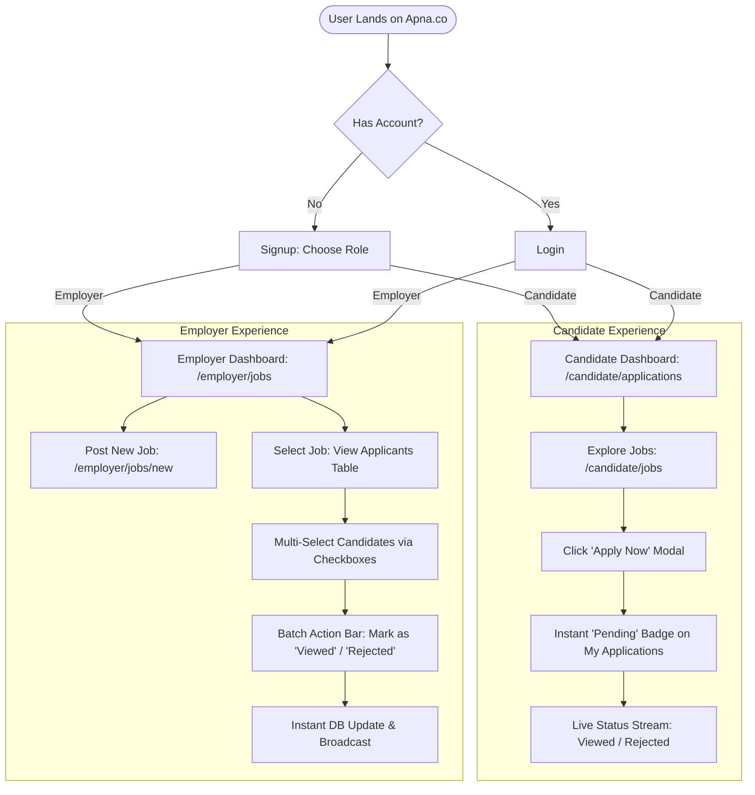

# Mock UX Design & User Experience Specification
**Project:** Apna.co Job Application Tracker  
**Module:** Product Design Planning & Low-Fidelity Wireframes  
**Team:** Team 07 (Squad 124)  

---

## 1. Product Problem Statement & UX Objective

> **"Apna.co wants a job application tracker where candidates see real-time status (viewed/rejected). When a candidate applies, the application appears immediately with a 'pending' label. Employers can batch-update statuses for multiple applications."**

### Core UX Objectives:
1. **Candidate Workflow:** Allow job seekers to discover jobs, submit applications with 1 click, and monitor application pipeline states (`pending` → `viewed` / `rejected`) without confusion.
2. **Employer Workflow:** Give hiring managers a dense, efficient multi-select candidate management table to batch-update application statuses in a single action.
3. **Information Hierarchy:** Follow the 5-second scan rule — KPI metrics first, status filters second, structured tables third.

---

## 2. System User Flow Map



---

## 3. Wireframes & Screen Layouts

### Screen 1: Candidate Dashboard (`/candidate/applications`)
**Primary Mode:** Monitor & Filter Mode (5-Second Scan)

```text
+---------------------------------------------------------------------------------------------------------+
| [LOGO] Apna.co | Job Tracker               (Role: Candidate) | 🔔 Notifications | 👤 John Doe (Logout)  |
+---------------------------------------------------------------------------------------------------------+
| [NAV]  📊 My Applications (Active)   |   🔍 Explore Jobs   |   👤 My Profile                            |
+---------------------------------------------------------------------------------------------------------+
|                                                                                                         |
|  MY APPLICATION PIPELINE                                                                                |
|  Track the progress of your submitted job applications in real time.                                    |
|                                                                                                         |
|  +-------------------+  +-------------------+  +-------------------+  +-------------------+             |
|  | TOTAL SUBMITTED   |  | PENDING REVIEW    |  | VIEWED BY RECRUIT |  | NOT SELECTED      |             |
|  |   12              |  |   7               |  |   4               |  |   1               |             |
|  | +2 this week      |  | ⏳ Awaiting scan  |  | 👁️ Profile seen   |  | ❌ Closed         |             |
|  +-------------------+  +-------------------+  +-------------------+  +-------------------+             |
|                                                                                                         |
|  -----------------------------------------------------------------------------------------------------  |
|  [🔍 Search Company / Role...           ]   [ Filter Status: All ▾ ]   [ Sort: Most Recent ▾ ]          |
|  -----------------------------------------------------------------------------------------------------  |
|                                                                                                         |
|  APPLICATIONS LIST                                                                                      |
|  +---------------------------------------------------------------------------------------------------+  |
|  | JOB ROLE & COMPANY               | APPLIED DATE | CURRENT STATUS          | RECRUITER ACTIVITY    |  |
|  +----------------------------------+--------------+-------------------------+-----------------------+  |
|  | Software Engineer Intern         | Aug 24, 2026 | [ 🟡 PENDING          ] | Awaiting employer rev |  |
|  | Swiggy • Bengaluru (Hybrid)      |              |                         |                       |  |
|  +----------------------------------+--------------+-------------------------+-----------------------+  |
|  | Frontend Developer (React)       | Aug 22, 2026 | [ 🔵 VIEWED           ] | Viewed today, 2:15 PM |  |
|  | Razorpay • Remote                |              |                         |                       |  |
|  +----------------------------------+--------------+-------------------------+-----------------------+  |
|  | Junior Backend Engineer          | Aug 20, 2026 | [ 🔴 REJECTED         ] | Closed by employer    |  |
|  | Zomato • Gurugram                |              |                         |                       |  |
|  +----------------------------------+--------------+-------------------------+-----------------------+  |
|                                                                                                         |
|  Showing 1-3 of 12 applications                            [ < Previous ]   [ Page 1 of 4 ]   [ Next > ]|
+---------------------------------------------------------------------------------------------------------+
```

---

### Screen 2: Job Board & Instant Apply Flow (`/candidate/jobs`)
**Primary Mode:** Explore & Action Mode

```text
+---------------------------------------------------------------------------------------------------------+
| [LOGO] Apna.co | Job Tracker                                               👤 John Doe (Candidate)      |
+---------------------------------------------------------------------------------------------------------+
| [NAV]  📊 My Applications   |   🔍 Explore Jobs (Active)   |   👤 My Profile                            |
+---------------------------------------------------------------------------------------------------------+
|                                                                                                         |
|  EXPLORE OPEN OPPORTUNITIES                                                                             |
|  [🔍 Search title, skills, or company...         ]   [ Location: All ▾ ]   [ Role Type: All ▾ ]         |
|                                                                                                         |
|  +---------------------------------------------------------------------------------------------------+  |
|  | Software Engineer Intern                                                    [ 🟢 APPLY NOW (CTA) ] |  |
|  | Flipkart • Bengaluru • Full-time • ₹35k/month                                                     |  |
|  | Skills: Next.js, TypeScript, PostgreSQL • Posted 2 hours ago • 14 Applicants                      |  |
|  +---------------------------------------------------------------------------------------------------+  |
|  | Junior Full Stack Developer                                                 [ 🟢 APPLY NOW (CTA) ] |  |
|  | PhonePe • Remote • Full-time • ₹6-8 LPA                                                           |  |
|  | Skills: React, Node.js, Prisma, Tailwind • Posted 1 day ago • 38 Applicants                       |  |
|  +---------------------------------------------------------------------------------------------------+  |
|                                                                                                         |
|  =====================================================================================================  |
|  [ POPUP MODAL: When user clicks "APPLY NOW" ]                                                          |
|  +---------------------------------------------------------------------------------------------------+  |
|  | APPLY FOR: Software Engineer Intern @ Flipkart                                            [ X ]   |  |
|  |                                                                                                   |  |
|  | Confirm Application Details:                                                                      |  |
|  | Candidate Name: John Doe (Pre-filled)                                                            |  |
|  | Email Address:  john.doe@example.com (Pre-filled)                                                 |  |
|  | Resume:         [ 📄 JohnDoe_Resume.pdf ]  [ Replace File ]                                       |  |
|  |                                                                                                   |  |
|  | ℹ️ Your application will appear immediately with a "Pending" label on your dashboard.            |  |
|  |                                                                                                   |  |
|  |                                                [ Cancel ]   [ 🚀 SUBMIT APPLICATION (Primary) ]   |  |
|  +---------------------------------------------------------------------------------------------------+  |
+---------------------------------------------------------------------------------------------------------+
```

---

### Screen 3: Employer Batch Management Dashboard (`/employer/jobs/[id]/applications`)
**Primary Mode:** Investigate & Batch Action Mode

```text
+---------------------------------------------------------------------------------------------------------+
| [LOGO] Apna.co | Employer Portal (Acme Corp)                                👤 Recruiter Team (Logout)  |
+---------------------------------------------------------------------------------------------------------+
| [NAV]  📊 Overview   |   💼 Job Postings (Active)   |   👥 All Candidates   |   ⚙️ Settings                 |
+---------------------------------------------------------------------------------------------------------+
|                                                                                                         |
|  JOB APPLICANTS: Software Engineer Intern                                 [ + Post New Job ]            |
|  Total Candidates: 48  |  Pending: 34  |  Viewed: 10  |  Rejected: 4                                    |
|                                                                                                         |
|  +===================================================================================================+  |
|  | ⚡ BATCH ACTION BAR (Appears when >= 1 checkbox selected)                                         |  |
|  | 3 candidates selected:  [ 👁️ Mark as VIEWED ]   [ ❌ Mark as REJECTED ]   [ Deselect All ]         |  |
|  +===================================================================================================+  |
|                                                                                                         |
|  [🔍 Search candidate name/email...]   [ Filter Status: All (48) ▾ ]   [ Export CSV ]                   |
|                                                                                                         |
|  +---------------------------------------------------------------------------------------------------+  |
|  | [x] SELECT | CANDIDATE NAME      | APPLIED ON   | MATCH SCORE | CURRENT STATUS | ACTION           |  |
|  +------------+---------------------+--------------+-------------+----------------+------------------+  |
|  | [✓]        | Aman Verma          | Today, 11:30 | 94%         | [ 🟡 PENDING ] | [ View Resume ↗ ]|  |
|  |            | aman.v@gmail.com    |              |             |                |                  |  |
|  +------------+---------------------+--------------+-------------+----------------+------------------+  |
|  | [✓]        | Priya Sharma        | Today, 10:15 | 88%         | [ 🟡 PENDING ] | [ View Resume ↗ ]|  |
|  |            | priya.s@gmail.com   |              |             |                |                  |  |
|  +------------+---------------------+--------------+-------------+----------------+------------------+  |
|  | [✓]        | Rahul Mehta         | Aug 23, 2026 | 91%         | [ 🟡 PENDING ] | [ View Resume ↗ ]|  |
|  |            | rahul.m@gmail.com   |              |             |                |                  |  |
|  +------------+---------------------+--------------+-------------+----------------+------------------+  |
|  | [ ]        | Sneha Patel         | Aug 22, 2026 | 72%         | [ 🔵 VIEWED  ] | [ View Resume ↗ ]|  |
|  |            | sneha.p@gmail.com   |              |             |                |                  |  |
|  +---------------------------------------------------------------------------------------------------+  |
|                                                                                                         |
|  Selected 3 of 48 items                                    [ < Previous ]   [ 1 ]  2  3   [ Next > ]    |
+---------------------------------------------------------------------------------------------------------+
```

---

## 4. Edge Cases: Empty & Error States

### A. Empty State: No Applications Yet
```text
+---------------------------------------------------------------------------------------------------+
|                                                                                                   |
|                                      📭 No Applications Yet                                       |
|                  You haven't submitted any job applications to Apna.co partners yet.              |
|                                                                                                   |
|                       Start exploring thousands of open jobs matching your profile!               |
|                                                                                                   |
|                                     [ 🔍 Explore Jobs Now (Primary CTA) ]                         |
|                                                                                                   |
+---------------------------------------------------------------------------------------------------+
```

### B. Error State: Session Expired / Unauthorized
```text
+---------------------------------------------------------------------------------------------------+
|                                                                                                   |
|  ⚠️ Session Expired or Access Denied                                                             |
|  Your session has timed out. Please log in again to access your dashboard.                        |
|                                                                                                   |
|  [ 🔄 Refresh Page ]                                   [ 🔐 Log In with Account (Primary) ]       |
|                                                                                                   |
+---------------------------------------------------------------------------------------------------+
```

---

## 5. Design Decisions & Rationale

1. **Floating Batch Bar**: Instead of static table-top controls, the batch bar dynamically reveals actions (`Mark as Viewed`, `Mark as Rejected`) only when items are checked, keeping the UI uncluttered during normal browsing.
2. **Immediate 'Pending' Feedback**: When applying, candidates see clear copy confirming that their submission instantly creates a `pending` status, aligning directly with the core problem statement.
3. **Atomic Multi-Row Mutations**: The employer interface triggers a single `PATCH /api/applications/batch` payload (`{ applicationIds: [...], newStatus: "..." }`), updating candidate statuses in one round trip.

---

## 6. Pre-Submission Review Checklist

- [x] **Understandable without verbal explanation**: Clear labels, visual hierarchy, and explicit action annotations.
- [x] **Above-the-fold KPIs**: 4 pipeline cards (`Total`, `Pending`, `Viewed`, `Rejected`) visible instantly.
- [x] **Explicit Filter Interactions**: Dropdowns, search inputs, and sort controls clearly delineated.
- [x] **Empty and Error states wireframed**: First-time user empty state and auth error banners specified.
- [x] **Direct PRD Alignment**: Fulfills the complete Apna.co real-time tracking and batch-update requirements.
