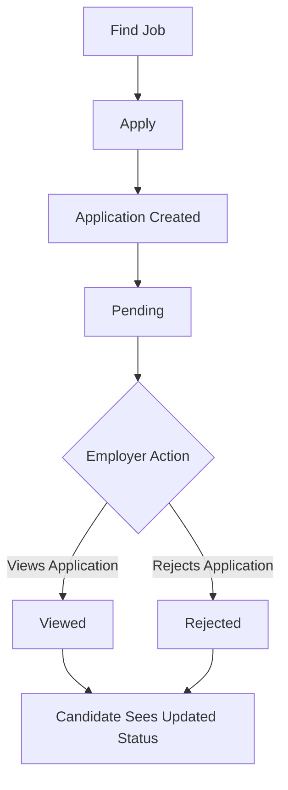
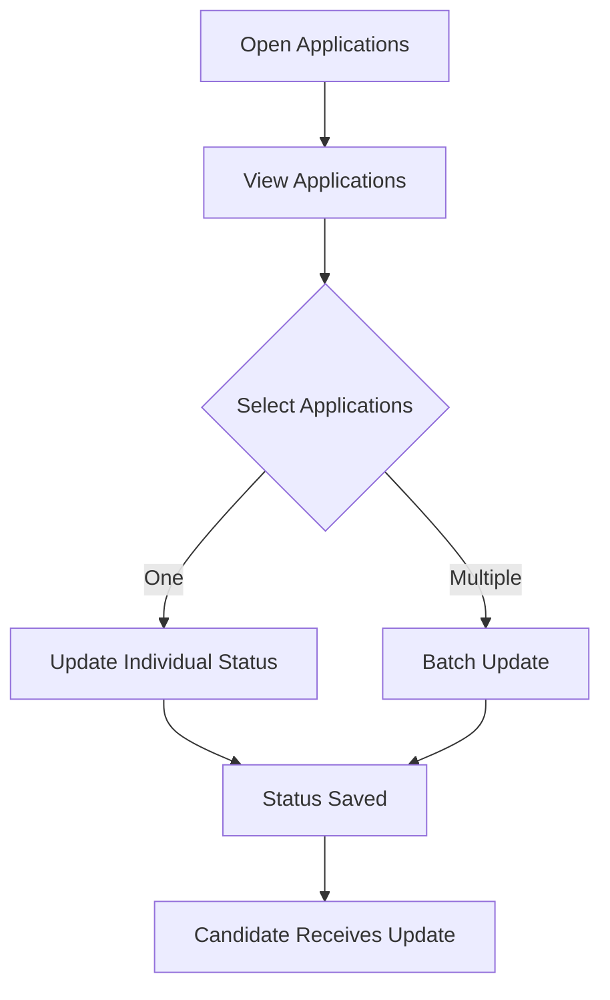

# 📋 Product Requirements Document

# Job Tracker Application

> **A real-time job application tracking experience for candidates and an efficient application-status management workflow for employers.**

---

## 📑 Document Control

| Field | Details |
|---|---|
| **Product** | Job Tracker Application |
| **Context** | Apna.co Job Application Tracker |
| **Document Type** | Product Requirements Document |
| **Version** | `v0.2` |
| **Status** | 🟠 Draft — Team Review |
| **Target Release** | MVP |
| **Primary Sprint** | Sprint 1 |
| **Authors** | Vidit Kochar, Mayank Sharma |
| **Date** | 19 August 2026 |

> **Purpose of this document:** Define **what** the Job Tracker must solve and **what** the MVP must deliver. Technical implementation belongs in `TRD.md`; interface and interaction specifications belong in `UIUX.md`.

---

## 🧭 Table of Contents

- [1. Executive Summary](#1-executive-summary)
- [2. Problem Statement](#2-problem-statement)
- [3. User Needs](#3-user-needs)
- [4. Target Users & Personas](#4-target-users--personas)
- [5. Product Vision](#5-product-vision)
- [6. Product Goals & Objectives](#6-product-goals--objectives)
- [7. Success Criteria & Metrics](#7-success-criteria--metrics)
- [8. Product Scope](#8-product-scope)
- [9. Core Features & Priorities](#9-core-features--priorities)
- [10. Primary User Flows & Use Cases](#10-primary-user-flows--use-cases)
- [11. User Stories](#11-user-stories)
- [12. Functional Requirements](#12-functional-requirements)
- [13. Application Status Model](#13-application-status-model)
- [14. Non-Functional Requirements](#14-non-functional-requirements)
- [15. Business Rules](#15-business-rules)
- [16. Sprint 1 Feature Scope](#16-sprint-1-feature-scope)
- [17. Edge Cases & Failure Scenarios](#17-edge-cases--failure-scenarios)
- [18. Assumptions & Constraints](#18-assumptions--constraints)
- [19. Out of Scope](#19-out-of-scope)
- [20. Acceptance Criteria](#20-acceptance-criteria)
- [21. Open Questions](#21-open-questions)
- [22. Team Review & Approval](#22-team-review--approval)
- [23. Definition of Done](#23-definition-of-done)
- [24. Future Enhancements](#24-future-enhancements)

---

# 1. Executive Summary

The **Job Tracker Application** gives candidates a clear, real-time view of their submitted job applications and gives employers an efficient workflow for managing application statuses.

### Core Experience

```text
Candidate Applies
       │
       ▼
Application Created
       │
       ▼
   🟡 PENDING
       │
       │ Employer takes action
       ▼
 ┌───────────────┐
 │               │
 ▼               ▼
🔵 VIEWED     🔴 REJECTED
 │               │
 └───────┬───────┘
         ▼
Candidate sees latest status
       in real time
```

### Product Value

| User | Value |
|---|---|
| 👤 **Candidate** | Transparency, confidence, and a single place to track applications. |
| 🏢 **Employer** | Faster application processing and efficient batch status management. |

### MVP Focus

The MVP focuses on four core capabilities:

1. **Immediate application visibility**
2. **Clear application status tracking**
3. **Real-time status synchronization**
4. **Individual and batch status updates for employers**

---

# 2. Problem Statement

## 2.1 Candidate Problem

After submitting a job application, candidates may not know whether their application was successfully recorded, whether an employer has viewed it, or whether it has been rejected.

This creates uncertainty and can cause candidates to repeatedly check for updates.

## 2.2 Employer Problem

Employers and recruiters may process a large number of applications. Updating each application individually can be repetitive and time-consuming.

## 2.3 Product Problem to Solve

The product must provide a single, reliable application-tracking experience that:

- immediately confirms successful applications through application visibility;
- starts every new application with a clear **Pending** status;
- reflects employer status changes to candidates in real time;
- allows employers to update individual applications; and
- allows employers to update multiple applications through batch actions.

> ### 💡 Problem Statement
> **How might we give candidates a transparent, real-time view of their job application status while giving employers a fast and efficient way to process application-status updates at scale?**

---

# 3. User Needs

## 3.1 Candidate Needs

Candidates need to:

- Know that their application was successfully recorded.
- See all submitted applications in one place.
- Understand the current status of every application.
- Know when an employer has viewed their application.
- Know when an application has been rejected.
- Receive status changes without manually refreshing the tracker.
- Trust that the displayed status is the latest successfully saved status.

## 3.2 Employer Needs

Employers need to:

- View applications received for their job postings.
- Identify applications requiring action.
- Update an individual application's status quickly.
- Select multiple applications.
- Apply a status update to multiple selected applications.
- Receive clear confirmation when an update succeeds or fails.

---

# 4. Target Users & Personas

## 👤 Persona A — Candidate

| Attribute | Description |
|---|---|
| **Role** | Job seeker |
| **Primary Goal** | Track submitted applications and understand their current status. |
| **Pain Points** | Uncertainty after applying, lack of employer visibility, repeated checking. |
| **Needs** | Immediate visibility, clear statuses, real-time updates, centralized tracking. |

### Candidate Scenario

> "I have applied to several jobs. I want to open one tracker and immediately know which applications are pending, viewed, or rejected."

---

## 🏢 Persona B — Employer / Recruiter

| Attribute | Description |
|---|---|
| **Role** | Employer / recruiter |
| **Primary Goal** | Review applications and process statuses efficiently. |
| **Pain Points** | Large application volumes and repetitive individual updates. |
| **Needs** | Application list, individual updates, multi-selection, batch updates, feedback. |

### Employer Scenario

> "I have many applications to process. I want to select several candidates and update their status together instead of doing the same action repeatedly."

---

# 5. Product Vision

> **Create a simple, reliable, and transparent job-application tracking experience where candidates always understand the current state of their applications and employers can process application statuses efficiently.**

### Product Principles

| Principle | Meaning |
|---|---|
| **Clarity** | Statuses should be immediately understandable. |
| **Transparency** | Candidates should not be left guessing about application state. |
| **Responsiveness** | Successful status changes should reach candidates quickly. |
| **Efficiency** | Employers should not repeat unnecessary actions. |
| **Reliability** | The UI should reflect the latest successfully saved state. |

---

# 6. Product Goals & Objectives

## 6.1 Primary Goals

| Goal | Objective |
|---|---|
| 🎯 **Application Transparency** | Give candidates immediate visibility into submitted applications. |
| 🎯 **Status Visibility** | Clearly communicate Pending, Viewed, and Rejected. |
| ⚡ **Real-Time Experience** | Reflect successful employer status changes without manual refresh. |
| 🚀 **Employer Efficiency** | Allow individual and batch status updates. |
| 🔒 **Reliability** | Keep candidate and employer views consistent with the latest saved status. |

## 6.2 Product Objectives

The MVP must:

1. Show a successfully submitted application immediately.
2. Assign **Pending** as the default status.
3. Allow authorized employers to update application statuses.
4. Support **Viewed** and **Rejected** statuses.
5. Allow employers to batch-update selected applications.
6. Reflect status changes to candidates in real time.
7. Provide clear feedback for successful and failed actions.

---

# 7. Success Criteria & Metrics

## 7.1 Candidate Success Criteria

- Successfully submitted applications appear in the tracker immediately.
- Every new application starts as **Pending**.
- Candidates can clearly identify the current status.
- Successful employer status changes are reflected without manual refresh.
- Candidate-facing status matches the latest successfully saved status.

## 7.2 Employer Success Criteria

- Employers can view applications for their job postings.
- Employers can update individual applications.
- Employers can select multiple applications.
- Employers can update selected applications in one batch action.
- Employers receive clear feedback after status operations.

## 7.3 Product Quality Metrics

| Metric | Purpose |
|---|---|
| **Application creation success rate** | Measures reliability of application submission. |
| **Immediate visibility rate** | Measures whether successful applications appear correctly. |
| **Real-time update success rate** | Measures reliability of status synchronization. |
| **Status synchronization error rate** | Measures consistency between stored and displayed status. |
| **Batch update success rate** | Measures employer workflow reliability. |
| **Average batch-processing time** | Measures efficiency gained from batch updates. |

> **Note:** Numeric targets should be agreed by the team before final MVP sign-off. The PRD defines the required measurement areas without inventing unsupported targets.

---

# 8. Product Scope

## ✅ 8.1 MVP Scope

The MVP covers:

- Candidate application submission
- Immediate application visibility
- Application tracking
- Pending status
- Viewed status
- Rejected status
- Employer application management
- Individual status updates
- Batch status updates
- Real-time status synchronization
- Success and error feedback
- Basic status consistency

## Scope Boundary

The MVP is intentionally limited to the **application tracking and status-management problem**.

> **Scope Rule:** New functionality should not be added to Sprint 1 without explicit team agreement and re-prioritization.

---

# 9. Core Features & Priorities

### Priority Definitions

| Priority | Meaning |
|---|---|
| **P0 — Must Have** | Required for MVP / Sprint 1 core workflow. |
| **P1 — Should Have** | Important, but can follow the core workflow if time is constrained. |
| **P2 — Could Have** | Useful enhancement, not required for MVP. |
| **P3 — Out of Scope** | Explicitly excluded from the current release. |

| ID | Feature | Priority | User | Description |
|---|---|---|---|---|
| F-01 | Application Submission | **P0** | Candidate | Candidate can successfully apply for a job. |
| F-02 | Immediate Application Visibility | **P0** | Candidate | Application appears immediately in tracker. |
| F-03 | Pending Status | **P0** | Candidate | Every new application starts as Pending. |
| F-04 | Candidate Application Tracker | **P0** | Candidate | Candidate views submitted applications and statuses. |
| F-05 | Employer Application List | **P0** | Employer | Employer views applications for managed jobs. |
| F-06 | Individual Status Update | **P0** | Employer | Employer updates an individual application. |
| F-07 | Batch Status Update | **P0** | Employer | Employer updates multiple selected applications. |
| F-08 | Real-Time Status Synchronization | **P0** | Candidate | Candidate receives successful changes without refresh. |
| F-09 | Success/Error Feedback | **P0** | Both | Product clearly communicates operation results. |
| F-10 | Status History | **P2** | Both | View previous status changes. |
| F-11 | Email/Push Notifications | **P2** | Candidate | Notify candidates outside the tracker. |
| F-12 | Application Withdrawal | **P2** | Candidate | Allow candidates to withdraw applications. |
| F-13 | Interview Workflow | **P3** | Both | Interview scheduling and related statuses. |
| F-14 | Offer Management | **P3** | Both | Offer-stage workflow. |
| F-15 | AI Candidate Screening | **P3** | Employer | Automated candidate screening/ranking. |

---

# 10. Primary User Flows & Use Cases

## 10.1 Candidate Flow



## 10.2 Employer Flow



---

## UC-01 — Candidate Applies for a Job

| Field | Details |
|---|---|
| **Actor** | Candidate |
| **Precondition** | Candidate is authenticated and a valid job is available. |
| **Trigger** | Candidate submits an application. |
| **Outcome** | Application is created and shown as Pending. |

### Main Flow

1. Candidate opens a job listing.
2. Candidate selects **Apply**.
3. Candidate submits the application.
4. System successfully creates the application.
5. Application appears in the candidate tracker.
6. Status is set to **Pending**.

---

## UC-02 — Candidate Tracks Application

| Field | Details |
|---|---|
| **Actor** | Candidate |
| **Precondition** | Candidate has submitted one or more applications. |
| **Trigger** | Candidate opens the tracker. |
| **Outcome** | Candidate sees current application statuses. |

### Main Flow

1. Candidate opens the application tracker.
2. System displays submitted applications.
3. Candidate views job, company, date, and status.
4. Candidate identifies the latest status.

---

## UC-03 — Employer Updates Individual Status

| Field | Details |
|---|---|
| **Actor** | Employer |
| **Precondition** | Employer is authorized to manage the application. |
| **Trigger** | Employer selects a status update. |
| **Outcome** | Status is saved and candidate is updated. |

### Main Flow

1. Employer opens the application list.
2. Employer selects an application.
3. Employer chooses a supported status.
4. System validates the action.
5. System saves the status.
6. Employer receives feedback.
7. Candidate receives the updated status.

---

## UC-04 — Employer Batch Updates Applications

| Field | Details |
|---|---|
| **Actor** | Employer |
| **Precondition** | Employer is authorized to manage selected applications. |
| **Trigger** | Employer submits a batch update. |
| **Outcome** | Selected applications are updated. |

### Main Flow

1. Employer opens the application list.
2. Employer selects multiple applications.
3. Employer chooses a status.
4. Employer submits the batch update.
5. System processes the selected applications.
6. System provides result feedback.
7. Candidate-facing trackers receive applicable updates.

---

## UC-05 — Real-Time Candidate Status Update

| Field | Details |
|---|---|
| **Actor** | Candidate |
| **Trigger** | Employer successfully changes an application status. |
| **Outcome** | Candidate sees the latest status without manual refresh. |

### Main Flow

1. Candidate has the tracker open.
2. Employer changes an application status.
3. Status is successfully saved.
4. Update is propagated to the candidate interface.
5. Candidate sees the new status.

---

# 11. User Stories

## 👤 Candidate Stories

### US-C01 — Submit Application

> **As a candidate, I want my application to appear immediately after applying so that I know my application was successfully recorded.**

### US-C02 — See Pending Status

> **As a candidate, I want a newly submitted application to display Pending so that I know the employer has not yet taken action.**

### US-C03 — Track Application Status

> **As a candidate, I want to see the current status of each application so that I can understand its progress.**

### US-C04 — Receive Real-Time Status Changes

> **As a candidate, I want application status changes to appear without manually refreshing the page so that I always see the latest status.**

### US-C05 — View Applications in One Place

> **As a candidate, I want to see my submitted applications in one place so that I can efficiently track my job applications.**

---

## 🏢 Employer Stories

### US-E01 — View Applications

> **As an employer, I want to view applications received for my job postings so that I can review candidates.**

### US-E02 — Update Individual Application

> **As an employer, I want to update an application's status so that the candidate can see the latest status.**

### US-E03 — Batch Update Applications

> **As an employer, I want to select multiple applications and update their status together so that I can process applications efficiently.**

### US-E04 — Receive Update Confirmation

> **As an employer, I want clear confirmation after an update so that I know whether the operation succeeded or failed.**

---

# 12. Functional Requirements

## 12.1 Application Creation

| ID | Requirement |
|---|---|
| **FR-01** | When a candidate successfully applies, the system must create an application record. |
| **FR-02** | The newly created application must appear in the candidate tracker immediately. |
| **FR-03** | Every newly created application must have **Pending** status. |

## 12.2 Candidate Tracking

| ID | Requirement |
|---|---|
| **FR-04** | Candidate must be able to view submitted applications. |
| **FR-05** | Each application should show job title, company, application date, and current status. |
| **FR-06** | Candidate must be able to identify the latest status clearly. |
| **FR-07** | Successful employer status changes must reach the candidate without manual refresh. |

## 12.3 Employer Management

| ID | Requirement |
|---|---|
| **FR-08** | Employer must be able to view applications for jobs they manage. |
| **FR-09** | Employer must be able to update an individual application. |
| **FR-10** | Employer must be able to select multiple applications. |
| **FR-11** | Employer must be able to apply a supported status to selected applications in one operation. |
| **FR-12** | Product must provide clear success/error feedback. |

## 12.4 Consistency

| ID | Requirement |
|---|---|
| **FR-13** | Candidate-facing status must represent the latest successfully saved status. |
| **FR-14** | Batch updates must affect only selected applications. |
| **FR-15** | Failed operations must not be presented as successful. |

---

# 13. Application Status Model

## 13.1 MVP Statuses

| Status | Meaning | Set By | Initial State |
|---|---|---|---|
| 🟡 **Pending** | Application submitted and awaiting employer action. | System | ✅ Yes |
| 🔵 **Viewed** | Employer has viewed/reviewed the application. | Employer | No |
| 🔴 **Rejected** | Employer has rejected the application. | Employer | No |

## 13.2 Status Lifecycle

```text
                 ┌──────────────┐
                 │ 🟡 PENDING   │
                 └──────┬───────┘
                        │
              ┌─────────┴─────────┐
              ▼                   ▼
       ┌──────────────┐    ┌──────────────┐
       │ 🔵 VIEWED    │    │ 🔴 REJECTED  │
       └──────────────┘    └──────────────┘
```

> **MVP Decision:** `Pending`, `Viewed`, and `Rejected` are the only application statuses in the current scope. Additional statuses must be approved before being added.

---

# 14. Non-Functional Requirements

| ID | Category | Requirement |
|---|---|---|
| **NFR-01** | Performance | Application creation and status updates should respond quickly enough for a smooth experience. |
| **NFR-02** | Real-Time | Successful status changes should reach the candidate interface with minimal delay. |
| **NFR-03** | Reliability | Product must reliably create applications and save status updates. |
| **NFR-04** | Security | Only authenticated and authorized users can access or modify application information. |
| **NFR-05** | Consistency | Candidate and employer views must reflect the latest successfully saved status. |
| **NFR-06** | Scalability | Product should support growth in users, jobs, and applications without changing the core workflow. |
| **NFR-07** | Usability | Statuses and actions should be easy to understand and use. |
| **NFR-08** | Availability | Core tracker and application-management workflows should remain available during normal operation. |

---

# 15. Business Rules

| ID | Rule |
|---|---|
| **BR-01** | Every successfully created application starts as **Pending**. |
| **BR-02** | Only authorized employers can change statuses for jobs they manage. |
| **BR-03** | Candidates cannot modify employer-controlled application statuses. |
| **BR-04** | Batch operations affect only explicitly selected applications. |
| **BR-05** | Batch update cannot be executed when no application is selected. |
| **BR-06** | Candidate-facing status must match the latest successfully saved state. |
| **BR-07** | Where duplicate applications are not permitted, repeated submissions must not create duplicate records. |

---

# 16. Sprint 1 Feature Scope

## 🎯 Sprint 1 Objective

> **Deliver the minimum end-to-end workflow: Candidate applies → Pending → Employer updates → Candidate sees the updated status in real time, including employer batch updates.**

## 16.1 Sprint 1 Backlog

| Priority | Feature | Sprint 1 |
|---|---|---|
| **P0** | Candidate application submission | ✅ |
| **P0** | Immediate application visibility | ✅ |
| **P0** | Pending status | ✅ |
| **P0** | Candidate application tracker | ✅ |
| **P0** | Employer application list | ✅ |
| **P0** | Individual status update | ✅ |
| **P0** | Viewed status | ✅ |
| **P0** | Rejected status | ✅ |
| **P0** | Batch status update | ✅ |
| **P0** | Real-time synchronization | ✅ |
| **P0** | Success/error feedback | ✅ |
| **P2** | Status history | ❌ |
| **P2** | Email/push notifications | ❌ |
| **P2** | Application withdrawal | ❌ |
| **P3** | Interview workflow | ❌ |
| **P3** | Offer management | ❌ |
| **P3** | AI screening | ❌ |

## 16.2 Sprint 1 End-to-End Demo

### Candidate Path

```text
Apply
  ↓
Application Created
  ↓
Pending
  ↓
Employer Action
  ↓
Viewed / Rejected
  ↓
Real-Time Candidate Update
```

### Employer Batch Path

```text
Select Multiple Applications
          ↓
      Choose Status
          ↓
      Batch Update
          ↓
 Selected Applications Updated
          ↓
 Candidate Statuses Synchronized
```

---

# 17. Edge Cases & Failure Scenarios

| ID | Scenario | Expected Behaviour |
|---|---|---|
| **EC-01** | Application submission fails | Do not present application as successfully submitted. |
| **EC-02** | Candidate opens tracker immediately after applying | Successfully created application appears as Pending. |
| **EC-03** | Employer updates non-existent application | Reject update and provide feedback. |
| **EC-04** | Unauthorized employer attempts update | Prevent action. |
| **EC-05** | Batch update partially fails | Clearly communicate actual result; do not falsely claim full success. |
| **EC-06** | Candidate is viewing tracker during status change | Candidate receives latest successful update. |
| **EC-07** | Candidate loses connectivity | Do not display an unconfirmed status as successful. |
| **EC-08** | Multiple updates occur close together | Final state reflects latest successfully saved state. |
| **EC-09** | Employer submits empty batch | Prevent operation and request selection. |
| **EC-10** | Candidate submits duplicate application | Apply the agreed duplicate-application rule. |

---

# 18. Assumptions & Constraints

## 18.1 Assumptions

1. Candidates are authenticated before applying.
2. Employers are authenticated before managing applications.
3. Employers can only manage applications associated with their job postings.
4. The platform already supports job listings and user accounts.
5. Application information can be persistently stored.
6. MVP supports Pending, Viewed, and Rejected.

## 18.2 Constraints

1. Sprint 1 must remain focused on the core application-tracking problem.
2. Technical architecture is not prescribed by this PRD.
3. Authentication and job listing are treated as existing capabilities/dependencies.
4. Numeric performance targets must be agreed before final sign-off.
5. New features require explicit team agreement and re-prioritization.

---

# 19. Out of Scope

The following are **not part of the current MVP**:

- ❌ Interview scheduling
- ❌ Offer management
- ❌ Candidate-employer messaging
- ❌ Salary negotiation
- ❌ Resume building
- ❌ Automated candidate ranking
- ❌ AI-based candidate screening
- ❌ Advanced employer analytics
- ❌ Complex multi-stage recruitment workflows
- ❌ Email/push notifications unless separately approved
- ❌ Application withdrawal unless separately approved
- ❌ Status history unless separately approved

---

# 20. Acceptance Criteria

## 20.1 Product Definition

- [ ] Problem statement is clearly defined.
- [ ] Candidate and employer needs are documented.
- [ ] Target users/personas are identified.
- [ ] Product goals and objectives are documented.
- [ ] Success criteria and measurement areas are documented.

## 20.2 Feature Definition

- [ ] Core features are documented.
- [ ] Features are prioritized using P0/P1/P2/P3.
- [ ] Sprint 1 feature scope is explicitly defined.
- [ ] Major user stories are documented.
- [ ] Major user flows/use cases are documented.

## 20.3 Candidate Workflow

- [ ] Candidate can successfully apply.
- [ ] Application record is created.
- [ ] Application appears immediately.
- [ ] New application displays Pending.
- [ ] Candidate can track submitted applications.
- [ ] Candidate can distinguish Pending, Viewed, and Rejected.
- [ ] Candidate receives successful status changes without manual refresh.

## 20.4 Employer Workflow

- [ ] Authorized employer can view applications.
- [ ] Employer can update an individual application.
- [ ] Employer can set status to Viewed.
- [ ] Employer can set status to Rejected.
- [ ] Employer can select multiple applications.
- [ ] Employer can perform a batch update.
- [ ] Unselected applications remain unchanged.
- [ ] Employer receives clear success/error feedback.

## 20.5 Requirements Quality

- [ ] Functional requirements are clear to the development team.
- [ ] Non-functional requirements are documented at product level.
- [ ] Business rules are documented.
- [ ] Edge cases are identified.
- [ ] Assumptions are documented.
- [ ] Constraints are documented.
- [ ] Out-of-scope items are documented.

## 20.6 Documentation & Review

- [ ] Both team members have reviewed the PRD.
- [ ] Sprint 1 scope is agreed.
- [ ] Open questions are resolved or explicitly accepted as TBD.
- [ ] Final PRD is committed to the repository.

---

# 21. Open Questions

| ID | Question | Status |
|---|---|---|
| OQ-01 | Should candidates receive email/push notifications? | TBD |
| OQ-02 | Can an employer move Viewed back to Pending? | TBD |
| OQ-03 | Should rejection include a reason? | TBD |
| OQ-04 | Should candidates withdraw applications? | TBD |
| OQ-05 | Should complete status history be maintained? | TBD |
| OQ-06 | How should partial batch-update failure be handled? | TBD |
| OQ-07 | What is the maximum batch size? | TBD |
| OQ-08 | What real-time delay is acceptable for MVP? | TBD |
| OQ-09 | What numerical performance/reliability targets define MVP sign-off? | TBD |

---

# 22. Team Review & Approval

This PRD must be reviewed by **both team members** before technical design and implementation begin.

## Review Checklist

- [ ] Vidit Kochar — Reviewed
- [ ] Mayank Sharma — Reviewed
- [ ] Problem statement agreed
- [ ] Target users agreed
- [ ] Product goals agreed
- [ ] Feature priorities agreed
- [ ] Sprint 1 scope agreed
- [ ] User flows agreed
- [ ] Acceptance criteria agreed
- [ ] Out-of-scope items agreed
- [ ] Open questions resolved or accepted as TBD
- [ ] Final PRD committed to repository

## Approval Record

| Reviewer | Role | Status | Date |
|---|---|---|---|
| **Vidit Kochar** | Team Member | ⏳ Pending Review | — |
| **Mayank Sharma** | Team Member | ⏳ Pending Review | — |

> **Approval rule:** Mark the PRD approved only after both team members have reviewed and agreed to the scope.

---

# 23. Definition of Done

The PRD is **Done** when:

- [ ] Problem statement is clearly defined.
- [ ] User needs are documented.
- [ ] Target users/personas are identified.
- [ ] Product vision and goals are documented.
- [ ] Success criteria are documented.
- [ ] Core features are documented and prioritized.
- [ ] Sprint 1 scope is clearly defined and agreed.
- [ ] Major user stories/use cases are documented.
- [ ] Primary user flows are covered.
- [ ] Functional requirements are clear to developers.
- [ ] Non-functional requirements are documented at product level.
- [ ] Business rules and edge cases are documented.
- [ ] Assumptions and constraints are documented.
- [ ] Out-of-scope items are documented.
- [ ] Acceptance criteria are defined.
- [ ] Open product decisions are identified.
- [ ] Both team members have reviewed the PRD.
- [ ] Final PRD is committed to the repository.
- [ ] The team has sufficient clarity to begin technical design and implementation.

---

# 24. Future Enhancements

Potential future versions may include:

1. **Shortlisted status**
2. **Interview scheduled status**
3. **Offer status**
4. **Application withdrawal**
5. **Email and push notifications**
6. **Employer notes**
7. **Interview scheduling**
8. **Advanced employer analytics**
9. **Application status history**
10. **Candidate-employer communication**

> Future enhancements must not expand Sprint 1 scope unless the team explicitly re-prioritizes the backlog.

---

## 🔗 Related Project Documents

| Document | Responsibility |
|---|---|
| [`PRD.md`](./PRD.md) | **What** the product must solve and deliver |
| [`TRD.md`](./TRD.md) | **How** the requirements will be technically implemented |
| [`UIUX.md`](./UIUX.md) | **How** the product will look and behave |

---

## 📌 Document Handoff

**PRD → TRD → UI/UX → Implementation**

```text
┌─────────────────────┐
│       PRD.md        │
│ What & Why          │
│ Product Requirements│
└──────────┬──────────┘
           │
           ▼
┌─────────────────────┐
│       TRD.md        │
│ How                 │
│ Technical Design    │
└──────────┬──────────┘
           │
           ▼
┌─────────────────────┐
│      UIUX.md        │
│ Experience & Design │
│ Screens + Flows     │
└──────────┬──────────┘
           │
           ▼
┌─────────────────────┐
│    Implementation   │
│    + Testing        │
└─────────────────────┘
```

> **Source of Truth:** Once reviewed and approved, this PRD becomes the product-level source of truth for Sprint 1 scope and acceptance.
