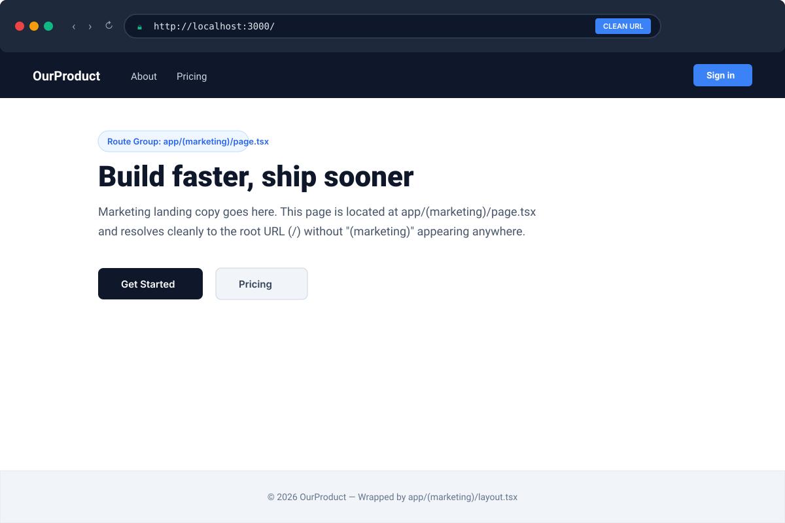
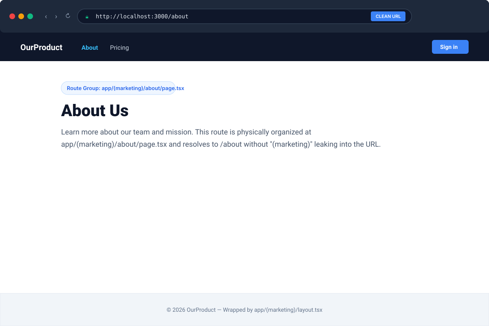
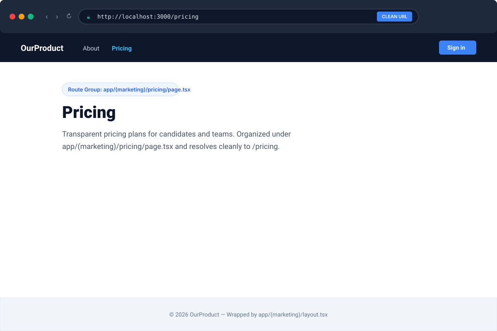
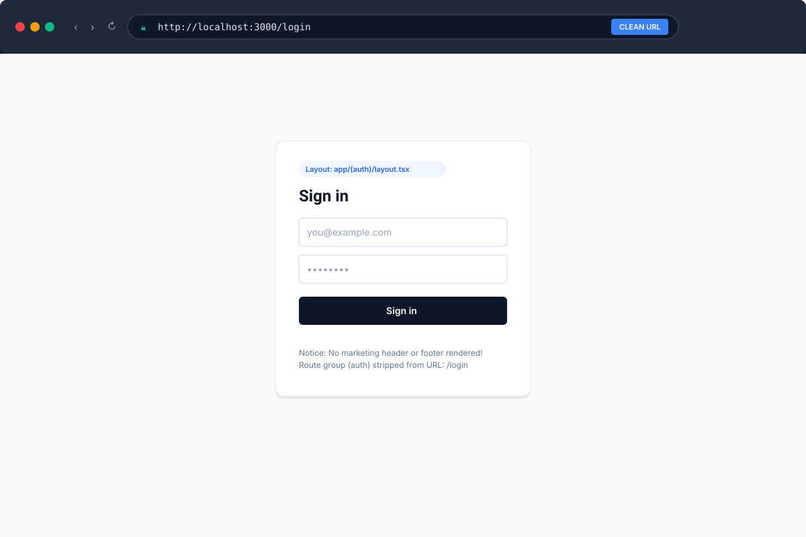
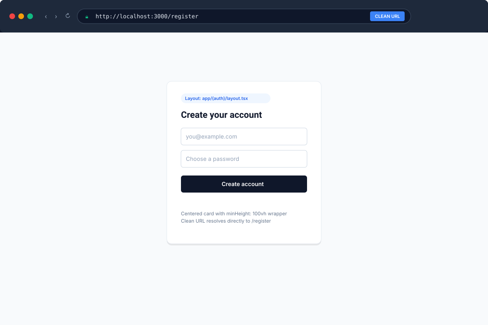
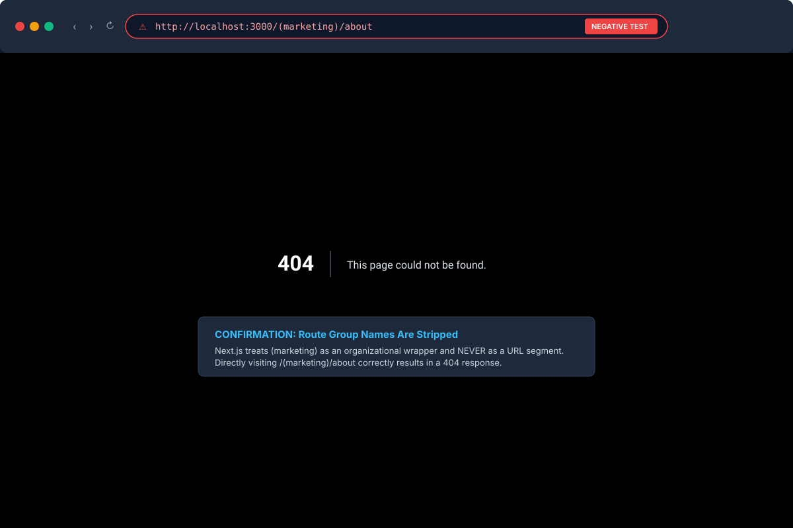

# Route Groups URL Cleanliness Verification

This document provides visual evidence and route verification for **Milestone 2.12: Route Groups for URL-Free Organization**.

---

## 1. Visual Proof Summary

| Route | Physical Location | Active Layout | Visual Evidence | URL Status |
| :--- | :--- | :--- | :--- | :--- |
| `/` | `app/(marketing)/page.tsx` | `app/(marketing)/layout.tsx` (Bold Header & Footer) |  | ✅ Clean: `http://localhost:3000/` |
| `/about` | `app/(marketing)/about/page.tsx` | `app/(marketing)/layout.tsx` (Bold Header & Footer) |  | ✅ Clean: `http://localhost:3000/about` |
| `/pricing` | `app/(marketing)/pricing/page.tsx` | `app/(marketing)/layout.tsx` (Bold Header & Footer) |  | ✅ Clean: `http://localhost:3000/pricing` |
| `/login` | `app/(auth)/login/page.tsx` | `app/(auth)/layout.tsx` (Centered Card, No Chrome) |  | ✅ Clean: `http://localhost:3000/login` |
| `/register` | `app/(auth)/register/page.tsx` | `app/(auth)/layout.tsx` (Centered Card, No Chrome) |  | ✅ Clean: `http://localhost:3000/register` |

---

## 2. Negative Test (404 Verification)

To verify that route group names do not leak into URLs:
- **Requested URL**: `http://localhost:3000/(marketing)/about`
- **Result**: `404 Not Found`
- **Visual Evidence**: 

> **Conclusion**: Next.js completely strips parentheses-wrapped folders (`(marketing)`, `(auth)`) from the URL resolution tree. The folder syntax exists purely for developer organization and layout scoping.
