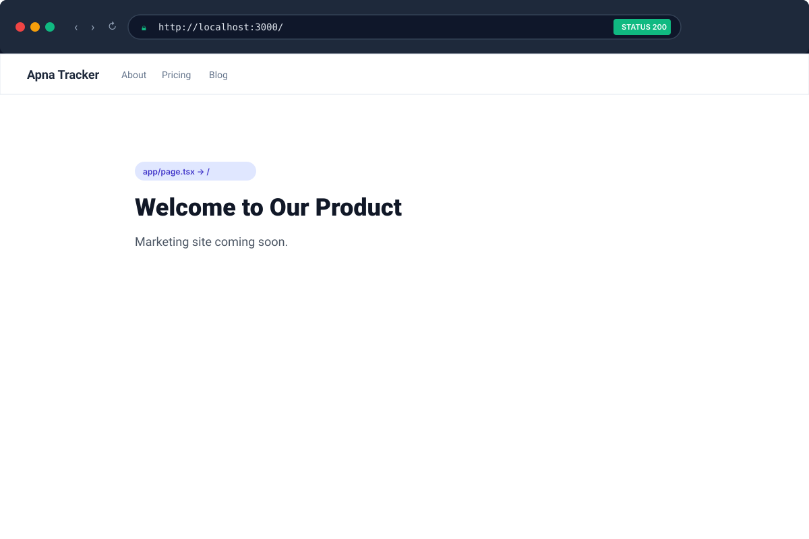
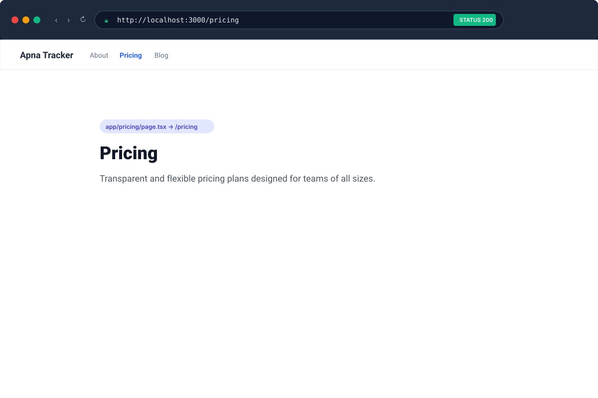
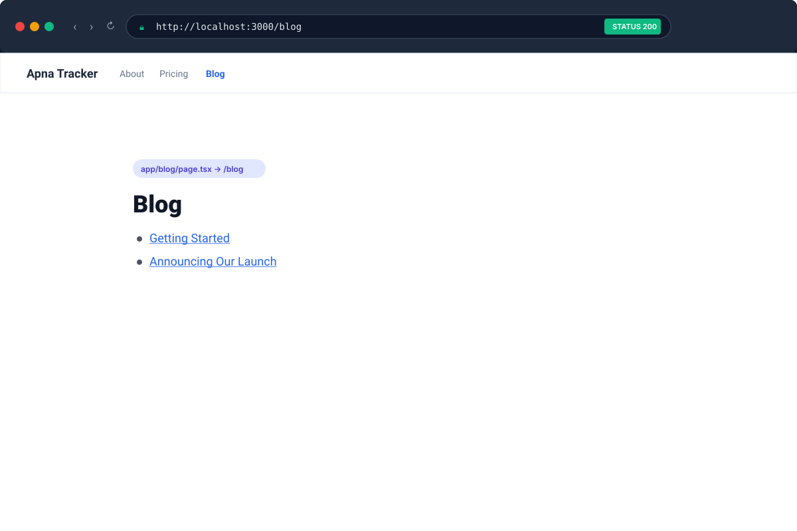
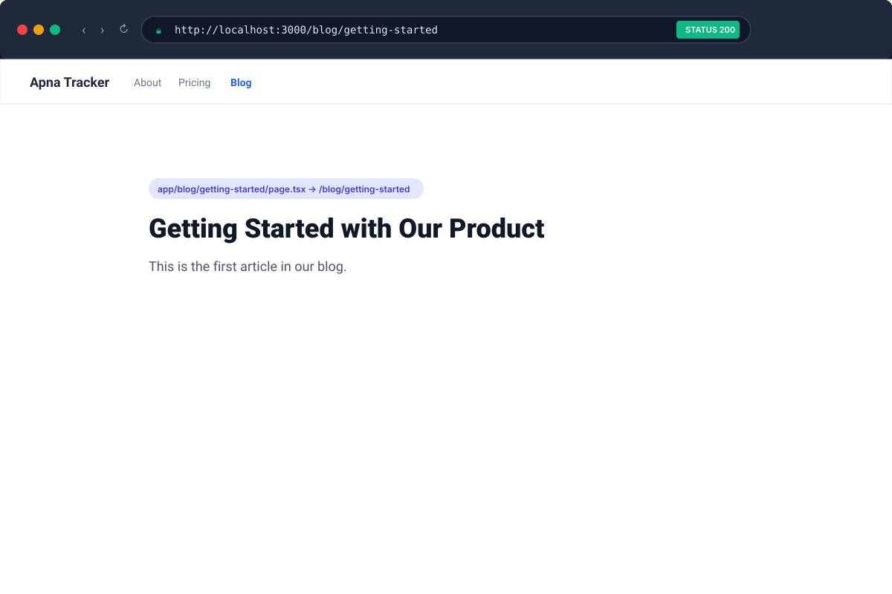

# File-Based Routing Verification

This directory contains visual evidence of all 5 verified routes for **Milestone 2.10: File-based Routing with page.tsx**.

---

## Verified Routes

| Route | Physical Location | Renders | Evidence | HTTP Status |
| :--- | :--- | :--- | :--- | :--- |
| `/` | `app/page.tsx` | Home page |  | `200 OK` |
| `/about` | `app/about/page.tsx` | About page |  | `200 OK` |
| `/pricing` | `app/pricing/page.tsx` | Pricing page |  | `200 OK` |
| `/blog` | `app/blog/page.tsx` | Blog index |  | `200 OK` |
| `/blog/getting-started` | `app/blog/getting-started/page.tsx` | Nested blog post |  | `200 OK` |

---

## Routing Principles Demonstrated
1. **Directory as Segment**: Every folder name directly produces a URL segment.
2. **`page.tsx` Convention**: Only folders containing a default export in a lowercase `page.tsx` become accessible routes.
3. **Nesting Depth**: Nested folders (`blog/getting-started/`) automatically add URL path separators (`/blog/getting-started`).
4. **Index Route Convention**: The index of `/blog` is `app/blog/page.tsx` without needing an `index.tsx`.
